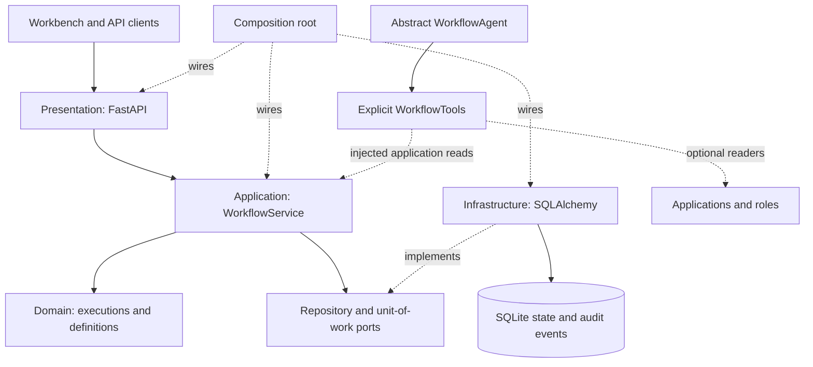
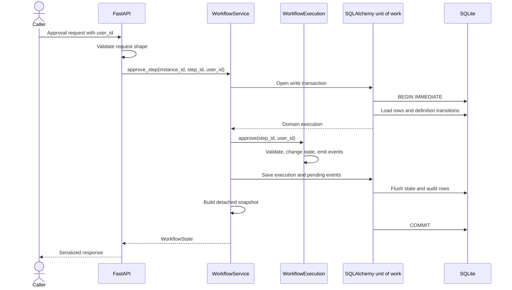

# Architecture

[Database design](database-design.md) | [Workflow flows](workflow-flows.md) |
[Project overview and setup](../README.md)

## Purpose And Scope

V0 proves a small deterministic workflow engine before adding AI reasoning. The running
system is a single Python process using FastAPI, Pydantic, SQLAlchemy, and SQLite. There
are no workers, queues, remote services, or LLM calls.

The domain execution is the authority for state and permission decisions. A future agent may
interpret an application or recommend actions, but cannot make an otherwise illegal
transition legal.

## Component Map

Arrows show code dependencies and wiring, not deployment boundaries. This is one modular
monolith with no enabled agent loop or external provider in the API.

## Responsibilities

| Component | Owns | Does not own |
| --- | --- | --- |
| [bootstrap.py](../workflow_engine/bootstrap.py) | Configuration, lifespan, concrete adapter wiring | Business rules or HTTP handlers |
| [presentation/api.py](../workflow_engine/presentation/api.py) | Routes, static serving, HTTP error mapping | Approval rules or database sessions |
| [static/app.js](../workflow_engine/static/app.js) | Browser state, user selection, action forms, API requests, audit rendering | Authoritative permissions or persisted workflow state |
| [presentation/demo.py](../workflow_engine/presentation/demo.py) | Fixed mock identities and display roles | Authentication or grants |
| [presentation/schemas.py](../workflow_engine/presentation/schemas.py) | HTTP request validation and shared response contracts | Legal transitions |
| [application/service.py](../workflow_engine/application/service.py) | Use-case orchestration and transaction scope through ports | SQL, HTTP objects, or permission decisions |
| [application/ports.py](../workflow_engine/application/ports.py) | Repository/unit-of-work interfaces | A specific database implementation |
| [application/contracts.py](../workflow_engine/application/contracts.py) | Commands and detached snapshots | HTTP status codes or ORM entities |
| [domain/workflow.py](../workflow_engine/domain/workflow.py) | Execution entities, permissions, transitions, audit intents | Persistence or HTTP |
| [domain/definitions.py](../workflow_engine/domain/definitions.py) | Reusable definitions and version invariants | Designers or database queries |
| [infrastructure/models.py](../workflow_engine/infrastructure/models.py) | Unchanged five-table schema and constraints | Workflow orchestration |
| [infrastructure/database.py](../workflow_engine/infrastructure/database.py) | SQLite setup, initialization, existing migration, triggers | Business permissions |
| [infrastructure/repository.py](../workflow_engine/infrastructure/repository.py) | ORM/domain mapping, persistence, commit/rollback | Approval decisions |
| [agents.py](../workflow_engine/agents.py) | Abstract agent interface and explicit reader tools | Database sessions or an implemented reasoning loop |

Domain depends only on standard-library execution types and existing Pydantic definition
validation. Application depends on domain and its own ports. Infrastructure implements
those ports; presentation invokes application. Agents import application contracts and
receive explicit readers. Bootstrap and the legacy constructor alone wire concrete
infrastructure into callers. No DI framework or circular import is used.

The original root modules remain compatibility facades. `WorkflowEngine(sessions, ...)`
subclasses WorkflowService solely to preserve its constructor. Root `api:app` delegates
to bootstrap. New layer code never imports these facades. See the complete
[directory and change record](refactor.md).

## Model Boundaries

WorkflowDefinition and StepDefinition are frozen reusable configuration. The ORM definition
row remains a name/version identity with adjacent transitions. WorkflowExecution represents
one instance and owns ordered StepExecution objects. Each execution holds an
ApprovalAssignment with current and original users, mapped to the same existing columns.
No extra assignment or execution-attempt table was introduced.

WorkflowEvent is a frozen envelope emitted by the domain and appended by the repository.
Database triggers protect historical rows. Each step row still represents current state;
repeated reviews remain visible in immutable audit history. This is not event sourcing.

## One Action, One Transaction

The snapshot is built inside the transaction, but the method only returns successfully
after the context manager commits. An error anywhere in a mutation rolls back state and
audit events together. No API handler needs to coordinate a second commit. Domain events
are acknowledged only after successful commit. Repeated saves do not duplicate events.
Failed approval validation does not mutate the domain execution before rollback.

Each call gets a fresh session. `BEGIN IMMEDIATE` reserves the SQLite writer before state
is read, so competing mutations are serialized. This is a local-prototype tradeoff, not
a high-throughput distributed locking strategy. SQLite's configured lock timeout is
10 seconds; exhausted contention is a database error, not a custom retry mechanism.

State and event reads use explicit `BEGIN` transactions. Multiple queries therefore see
a consistent database snapshot. Closing the session ends that transaction. Response
models are detached data, not live ORM objects with permission to persist changes.

## Definition Lifecycle

There are two classes named `WorkflowDefinition`, with different responsibilities:

- The Pydantic class in [domain/definitions.py](../workflow_engine/domain/definitions.py) holds the
  frozen Python specification, including its ordered steps.
- The ORM class in [infrastructure/models.py](../workflow_engine/infrastructure/models.py) stores only ID, name, and version.

When creating an instance, the repository finds or inserts the definition by `(name, version)`.
On first use it persists adjacent-step transitions. Every new instance receives its own
step rows and reviewer assignments. Later approvals follow the stored transition rows;
they do not ask an agent or inspect application data.

The API defaults to Technical Risk Assessment version 1. Engine construction and
`create_app(definition=...)` can supply another sequential approval specification with
one or more steps. `GET /workflow-definition` exposes the configured specification
read-only; the workbench generates assignments from it.

Increment the version when changing steps. Reusing a version with different Python steps
is rejected by comparing persisted transitions and instance steps. Existing instances keep their stored
steps and reference that version's transitions, not a private copy of the transition graph.

## Local Workbench

FastAPI serves the browser workbench at `/` and bundled assets under `/static`. The UI
uses the same-origin JSON endpoints and has no frontend build or external asset dependency.
`GET /workflows` reads all state snapshots newest first; it is unpaginated for this small
prototype. `GET /demo/users` returns the fixed mock-user directory from Python code.

Changing the selected user changes the submitted `user_id`. The browser disables actions
based on the creation event and current assignee, but these checks are only convenience:
the engine independently validates every action. Display roles confer no authority.
An unsuccessful post-mutation refresh disables further mutations until fresh data loads.

Send-back and forwarding use the same transactional engine boundary. Send-back validates
the stored path to an approved previous step, resets the target/downstream current states,
and activates the target. Forwarding changes only the current assignee after an injected
eligibility check. The API supplies the mock-user directory as its eligibility policy;
direct engine callers without a policy cannot forward. Original assignees and every prior
event remain intact, including across repeated rework cycles.

The UI does not seed assessments, log users in, add new tables, or call an agent. Browser
fixtures were used for UI checks while backend dependencies were unavailable; they are
not part of the application and do not prove engine behavior.

## Agent Boundary

`WorkflowAgent.run(context)` is abstract. `AgentContext` contains an instance ID and actor
ID, but is not an authenticated identity or an automatically enforced security policy.
The agent receives `WorkflowTools`, rather than a SQLAlchemy session.

| Tool | V0 behavior |
| --- | --- |
| `get_workflow_state` | Calls the injected reader and returns a deep copy of the snapshot |
| `get_application` | Returns copied external data if a reader was injected; otherwise raises `ToolUnavailable` |
| `get_available_roles` | Returns a copied list if a reader was injected; otherwise raises `ToolUnavailable` |
| `add_approval` | Raises `ToolUnavailable` |
| `request_information` | Raises `ToolUnavailable` |
| `escalate_workflow` | Raises `ToolUnavailable` |

There is no agent approval tool in V0. Future mutation tools must bind a verified actor
and call a deterministic engine operation. Do not enable placeholder methods by letting
them write directly to the database. This is a dependency boundary, not a sandbox that
can safely execute arbitrary Python from an untrusted agent.

## Startup And Shutdown

`create_app()` constructs the FastAPI application without opening the database. Its lifespan
handler opens SQLite on startup, creates missing tables, backfills legacy original
assignees through an additive migration, creates audit triggers, and installs
a `WorkflowService` on application state under the preserved `workflow_engine` attribute.
Bootstrap owns this wiring. Shutdown disposes the database engine. Static files remain
in their original directory and package-data configuration is unchanged.

Database URL selection is: an explicit `create_app(database_url)` argument, then
`WORKFLOW_DATABASE_URL`, then `sqlite:///./workflow.db`. The file path is relative to the
process working directory. The database helpers are SQLite-specific in V0.

## Security And Verification Limits

Permissions compare caller-supplied strings with the submitter or assigned reviewer.
They are deterministic but not authenticated. Reads are unrestricted, roles have no
permission meaning, and no tenant boundary exists. Keep this prototype local.

Audit triggers block row updates and deletes; a database administrator can remove them.
Foreign keys and enum checks do not replace engine-level workflow validation.

Source files passed syntax compilation during initial setup, but native dependency
installation prevented pytest and server startup verification. A temporary Docker runtime
with preinstalled libraries now runs the real app; browser approval and isolated API/SQLite
smoke checks passed. The pre-refactor suite passed 87 tests; the post-refactor suite passed
104 tests in an isolated container with offline
pytest 7.4.4 tooling; the declared pytest 8+ range remains unverified. See the
[current container setup](../README.md) for the networking workaround and restart commands.
Architecture tests enforce inward imports and check domain/application/agent-tool imports
with SQLAlchemy and FastAPI blocked. Domain tests and an in-memory application adapter
exercise rules without a database or HTTP server. Commit failures, repeated saves, legacy
imports, environment wiring, and ASGI startup have explicit tests. Live data/schema hashes
matched before/after startup: 7 instances and 56 events.