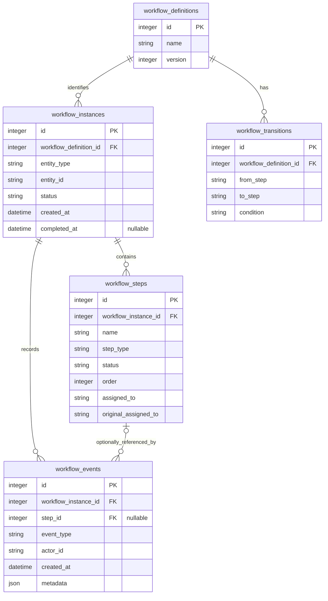

# Database Design

[Architecture](architecture.md) | [Workflow flows](workflow-flows.md) |
[Project overview and setup](../README.md)

The schema is defined in [infrastructure/models.py](../workflow_engine/infrastructure/models.py) and initialized by
[infrastructure/database.py](../workflow_engine/infrastructure/database.py). SQLite stores workflow state and history;
it does not store application details, users, roles, or agent conversations.

The local UI's mock users are fixed Python data in [presentation/demo.py](../workflow_engine/presentation/demo.py).
Their IDs are stored only as existing `assigned_to` and `actor_id` strings when used in
workflows. There is no users table, user foreign key, or authentication schema.

## Entity Relationships

The diagram represents database relationships, not every engine invariant. The schema
can represent an instance with zero steps, but the engine creates a nonempty sequence.
A workflow-level event has no step reference; a step-level event references one step.

## Tables And Fields

Types below are logical SQLAlchemy types. SQLite stores strings with text affinity and
JSON as serialized text; it has no native enum or timezone-aware datetime type.

### workflow_definitions

One reusable workflow identity per name/version. Its Python specification supplies steps
when an instance is created; this table is not a complete serialized definition.

| Field | Type | Nullable | Meaning |
| --- | --- | --- | --- |
| `id` | Integer, primary key | No | Generated definition ID |
| `name` | String | No | For example, Technical Risk Assessment |
| `version` | Integer | No | Definition version, initially 1 |

`UNIQUE(name, version)` prevents duplicate identities. Positive versions are validated
in the Python specification, not by a database check constraint.

### workflow_instances

One assessment of one externally owned entity. Multiple instances may reference the same
entity; there is no uniqueness constraint on entity references.

| Field | Type | Nullable | Meaning |
| --- | --- | --- | --- |
| `id` | Integer, primary key | No | Generated instance ID |
| `workflow_definition_id` | Integer, foreign key | No | References `workflow_definitions.id` |
| `entity_type` | String | No | External entity category, such as `application` |
| `entity_id` | String | No | External identifier, such as `app-123` |
| `status` | Enum stored as string | No | Workflow lifecycle state; ORM default is Pending |
| `created_at` | DateTime | No | ORM-generated creation timestamp |
| `completed_at` | DateTime | Yes | Terminal timestamp for Completed, Rejected, or Cancelled |

The submitter is intentionally not a separate column. The engine reads the `actor_id`
of this instance's `workflow_created` event to authorize starting and cancellation.

### workflow_steps

A concrete approval step belonging to one instance. Each instance has its own status
and assignee even when it shares a definition with other instances.

| Field | Type | Nullable | Meaning |
| --- | --- | --- | --- |
| `id` | Integer, primary key | No | Generated step ID |
| `workflow_instance_id` | Integer, foreign key | No | References `workflow_instances.id` |
| `name` | String | No | Step name used to resolve transitions |
| `step_type` | String | No | `approval` in V0 |
| `status` | Enum stored as string | No | Step state; ORM default is Pending |
| `order` | Integer | No | One-based display and initial activation order |
| `assigned_to` | String | No | Reviewer identifier compared with the caller's `user_id` |
| `original_assigned_to` | String | No | First assigned reviewer; unchanged by forwarding or rework |

`UNIQUE(workflow_instance_id, order)` and `UNIQUE(workflow_instance_id, name)` prevent
duplicate positions and names within an instance. They do not require contiguous order
values or enforce that only one step is Active. Those properties come from the engine's
sequential creation and transition behavior. Raw SQL must quote `"order"`.

### workflow_transitions

Shared definition-level links. On first use of version 1, the engine inserts:

| from_step | to_step | condition |
| --- | --- | --- |
| Engineer Approval | Manager Approval | `always` |
| Manager Approval | Final Approval | `always` |

| Field | Type | Nullable | Meaning |
| --- | --- | --- | --- |
| `id` | Integer, primary key | No | Generated transition ID |
| `workflow_definition_id` | Integer, foreign key | No | References `workflow_definitions.id` |
| `from_step` | String | No | Source step name |
| `to_step` | String | No | Target step name |
| `condition` | String | No | ORM default `always`; the only supported condition |

`UNIQUE(workflow_definition_id, from_step)` permits at most one outgoing link per step.
Names are not foreign keys to instance steps: transitions are shared across instances,
while step IDs are instance-specific. The engine resolves a target by name within the
current instance and requires that target to be Pending.

Final Approval has no outgoing row. Absence of a transition means completion only when
every instance step is Approved; otherwise the engine rejects and rolls back the action.
The schema does not support multiple outgoing conditional branches or parallel activation.

### workflow_events

Append-only audit records for successful state changes, not a log of failed HTTP requests.

| Field | Type | Nullable | Meaning |
| --- | --- | --- | --- |
| `id` | Integer, primary key | No | Event identifier; API history is sorted by this field |
| `workflow_instance_id` | Integer, foreign key | No | References `workflow_instances.id` |
| `step_id` | Integer, foreign key | Yes | References `workflow_steps.id` for step-level events |
| `event_type` | String | No | Event name, such as `step_approved` |
| `actor_id` | String | No | Caller whose operation caused the event |
| `created_at` | DateTime | No | ORM-generated event timestamp |
| `metadata` | JSON | No | Additional event data; ORM default is an empty object |

The ORM attribute is `event_metadata` because SQLAlchemy reserves `metadata`. The physical
column and API response field are both `metadata`. Rejection stores `{"reason": "..."}`.
Creation records step IDs and initial assignments. `step_sent_back` records target ID,
reason, and each affected step's previous/reset status; a following `step_activated`
records target activation. `approval_forwarded` records from/to/original assignee and
reason. Other current events store `{}`. Current step rows are authoritative for action
eligibility; immutable history explains how they got there. Legacy creation events are
not rewritten to add assignment metadata.

## Storage Details

SQLAlchemy's enums persist **member names**, not their display values:

| Kind | SQLite strings | API and Python enum values |
| --- | --- | --- |
| Workflow | `PENDING`, `RUNNING`, `COMPLETED`, `REJECTED`, `CANCELLED` | Pending, Running, Completed, Rejected, Cancelled |
| Step | `PENDING`, `ACTIVE`, `APPROVED`, `REJECTED`, `SKIPPED` | Pending, Active, Approved, Rejected, Skipped |

Enum check constraints restrict stored state names, but do not validate transitions
between them. A database write could otherwise change Running to Pending; engine rules
prevent that on the supported action paths.

Timestamps use Python-generated naive UTC values. A returned timestamp has no timezone
suffix and must be interpreted as UTC. ORM defaults run on inserts performed through
SQLAlchemy; they are not server defaults for arbitrary SQL inserts. Integer primary keys
are database-generated identifiers, not business identifiers.

## Constraints And Audit Protection

`PRAGMA foreign_keys=ON` is applied to each connection created by the database helper.
The engine also checks that an action's step belongs to its supplied instance. The separate
event foreign keys do not enforce that an event's step belongs to the same instance;
engine event creation supplies that consistency.

Two SQLite triggers are installed at initialization:

- `workflow_events_no_update` rejects event updates.
- `workflow_events_no_delete` rejects event deletion.

Both raise `Workflow events are immutable`. Inserts remain allowed. These triggers protect
history during normal database access, not against someone who can change the schema or
replace the database file. No delete cascades, retention job, or history-pruning API exists.

State and event inserts commit in one engine transaction. Invalid actions leave no
committed state change or new event. Failed-action auditing would require a separate,
explicit design and is not implemented.

The architectural refactor made no schema changes and needs no new migration. The
repository maps domain execution/assignment objects to these same columns. The unit of
work owns SQLite transaction mechanics; the service owns operation scope. The existing
original-assignee migration and audit triggers are unchanged. Live data and schema hashes
matched before/after refactored startup: 7 instances and 56 audit events.

## Indexes And Operations

The model declares nonunique indexes on `workflow_steps.workflow_instance_id` and
`workflow_events.workflow_instance_id`. Unique constraints cover definition identity,
step names/positions, and transition sources. This is sufficient for a small prototype;
no extra speculative indexes are added.

Startup uses `Base.metadata.create_all()`, one explicit additive migration, and idempotent
trigger creation. Under `BEGIN IMMEDIATE`, a legacy steps table receives the NOT NULL
`original_assigned_to` column and is backfilled from `assigned_to`. Repeated initialization
does not overwrite it after forwarding. Existing instances/events and enum constraints
remain unchanged; no `SentBack` state or history table rebuild is needed. There is no
general migration framework; other incompatible schema changes still need explicit design.

Increment definition versions when changing workflow steps, preserve stored transitions
used by existing instances, and never edit workflow state manually as a substitute for an
engine operation. Future migrations or definition storage should retain these boundaries.