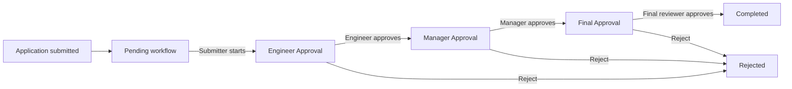
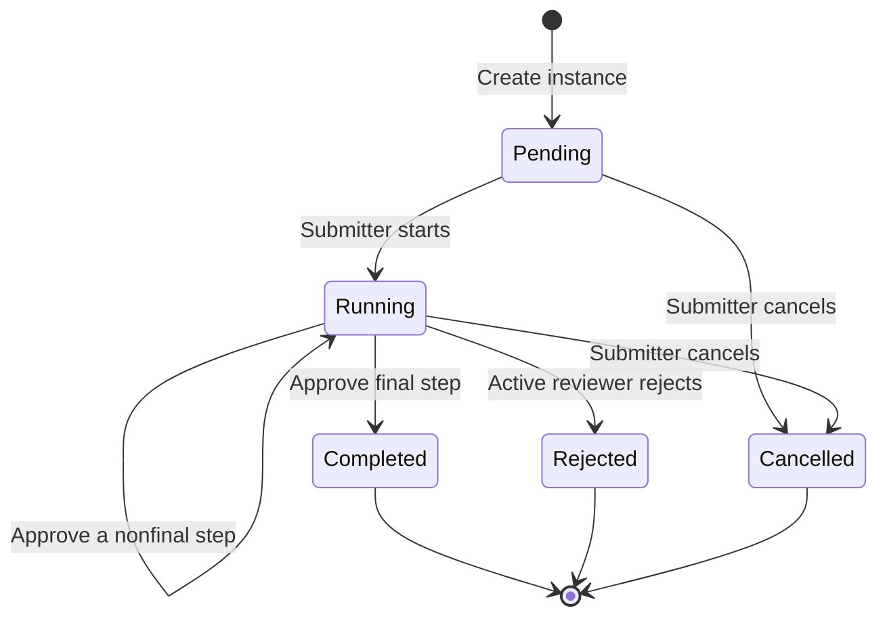
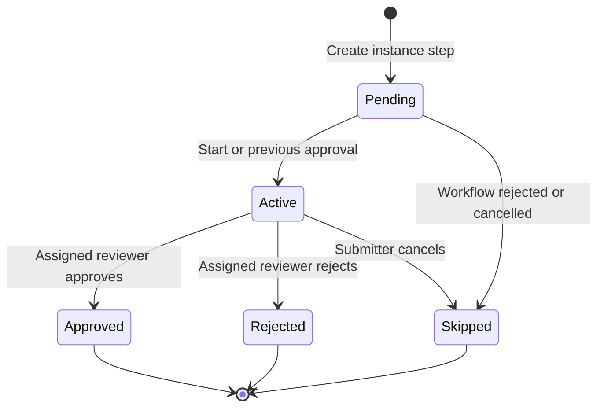
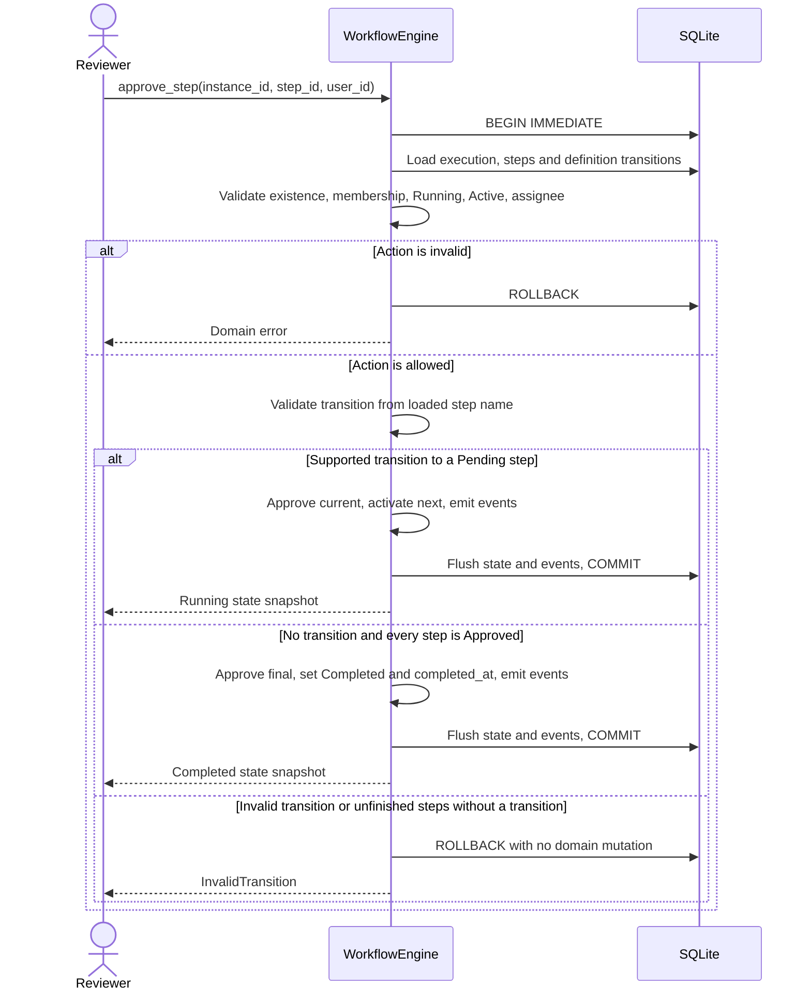

# Workflow Flows

[Architecture](architecture.md) | [Database design](database-design.md) |
[Setup and runnable API example](../README.md)

These flows describe [WorkflowService](../workflow_engine/application/service.py) invoking
[domain rules](../workflow_engine/domain/workflow.py), not an LLM plan. The legacy
[WorkflowEngine](../workflow_engine/engine.py) constructor delegates to the service.
All transitions are deterministic. The current
[Technical Risk Assessment definition](../workflow_engine/definitions.py) has three
sequential approval steps with unconditional links.

## Business Flow



The engine stores only a reference to the application. Submission creates a Pending
instance; it does not automatically start the assessment. Cancellation, omitted from
this business diagram for clarity, is available to the submitter while Pending or Running.

## Workflow State Machine



Completed, Rejected, and Cancelled are terminal. There is no restart, reopen, resume, or
undo operation. `completed_at` is null until termination, then records the terminal UTC
timestamp even when the result is rejection or cancellation.

## Step State Machine



The supported sequential flow has one Active step while Running. Rejection and cancellation
remove unfinished work by marking remaining Pending or Active steps Skipped. They never
change a previously Approved step. Skipping is internal to these terminal operations;
there is no public skip endpoint.

## Operation Rules

| Operation | Preconditions | Result |
| --- | --- | --- |
| `create_workflow` | Nonblank entity/actor identifiers; exact assignment keys for every defined step | Pending instance with Pending steps |
| `start_workflow` | Existing Pending instance; actor is submitter; all steps Pending | Running instance; first ordered step Active |
| `approve_step` | Existing Running instance; step belongs to it and is Active; actor is assignee | Step Approved; next step Active or workflow Completed |
| `reject_step` | Same instance/step/assignee checks as approval; nonblank reason | Step Rejected; unfinished steps Skipped; workflow Rejected |
| `cancel_workflow` | Existing Pending or Running instance; actor is submitter | Unfinished steps Skipped; workflow Cancelled |
| `get_workflow_state` | Instance exists | Snapshot with ordered steps; no mutation |
| `get_events` | Instance exists | History ordered by event ID; no mutation |

Start/cancel permission comes from the creation event's actor. Approve/reject permission
comes from the step's exact `assigned_to` string. A role such as "manager" has no special
authority unless it is also the assigned identifier. The submitter has no approval
override unless explicitly assigned to that step.

All identities are caller-supplied in V0. These rules are not authentication, and anyone
with API access can claim an assignee's identity. Read access is unrestricted.

## Creation And Start

1. Validate the submission and require exactly the definition's assignment names.
2. Find the definition by name/version; on first use, insert it and its adjacent transitions.
3. Insert the Pending instance and its individually assigned Pending steps.
4. Record `workflow_created` with the submitter as actor and commit.
5. On a separate start request, validate Pending state and submitter identity.
6. Set Running, activate the first step, record `workflow_started` and `step_activated`, and commit.

For this definition, creation requires assignment keys `Engineer Approval`, `Manager Approval`,
and `Final Approval`. The first step is chosen by stored `order`, starting at 1, rather than
by an application-specific condition inside the engine.

## Approval Sequence



The validation order is workflow existence, step existence and membership, Running
workflow state, Active step state, then assignee permission. Transition validation precedes
in-memory approval mutation inside the same transaction. A transition condition other than
`always`, missing target, or non-Pending target rejects the entire action.

Completion is not inferred merely because no transition row exists: the engine also
requires every instance step to be Approved. A broken graph cannot silently complete
with unfinished steps.

### Happy-Path Snapshots

| Successful action | Workflow | Engineer | Manager | Final |
| --- | --- | --- | --- | --- |
| Create | Pending | Pending | Pending | Pending |
| Start | Running | Active | Pending | Pending |
| Engineer approves | Running | Approved | Active | Pending |
| Manager approves | Running | Approved | Approved | Active |
| Final reviewer approves | Completed | Approved | Approved | Approved |

The final approval records both `step_approved` and `workflow_completed` in the same
transaction. There is no separate completion endpoint.

## Rejection Flow

A nonblank reason is required and whitespace is trimmed. The engine checks the same
membership, state, and assignee rules as approval, then performs one transaction:

1. Mark the active step Rejected and record `step_rejected` with its reason in metadata.
2. Mark unfinished steps Skipped and record `step_skipped` for each, in step order.
3. Set the workflow Rejected, set `completed_at`, and record `workflow_rejected`.

For example, rejecting Manager Approval after the engineer has approved produces:

| Workflow | Engineer | Manager | Final |
| --- | --- | --- | --- |
| Rejected | Approved | Rejected | Skipped |

The engine does not automatically request more information, add a reviewer, or ask an
agent to reconsider. A new assessment requires a new instance.

## Cancellation Flow

The submitter can cancel before starting or while Running. The engine marks all Pending
and Active steps Skipped, records each `step_skipped`, then sets Cancelled, sets
`completed_at`, and records `workflow_cancelled` in the same transaction.

| When cancelled | Workflow | Engineer | Manager | Final |
| --- | --- | --- | --- | --- |
| Before start | Cancelled | Skipped | Skipped | Skipped |
| After engineer approval | Cancelled | Approved | Skipped | Skipped |

There is no required cancellation reason in V0. Assigned reviewers do not gain cancellation
permission solely from their assignments.

## Audit Events

| Event | Step reference | Metadata | Actor |
| --- | --- | --- | --- |
| `workflow_created` | None | Initial step IDs and assignees (legacy events may be empty) | Submitter |
| `workflow_started` | None | `{}` | Submitter |
| `step_activated` | Activated step | `{}` | Caller whose start/approval activated it |
| `step_approved` | Approved step | `{}` | Assigned reviewer |
| `step_rejected` | Rejected step | `{"reason": "..."}` | Assigned reviewer |
| `step_skipped` | Skipped step | `{}` | Caller whose rejection/cancellation skipped it |
| `workflow_completed` | None | `{}` | Final approving reviewer |
| `workflow_rejected` | None | `{}` | Rejecting reviewer |
| `workflow_cancelled` | None | `{}` | Submitter |
| `step_sent_back` | Sending step | Target ID, reason, reset step statuses | Current assignee |
| `approval_forwarded` | Forwarded step | From/to/original assignee, reason | Current assignee |

On the happy path, the instance's ordered event history is:

```text
workflow_created                       submitter
workflow_started                       submitter
step_activated   Engineer Approval     submitter
step_approved    Engineer Approval     engineer
step_activated   Manager Approval      engineer
step_approved    Manager Approval      manager
step_activated   Final Approval        manager
step_approved    Final Approval        final
workflow_completed                     final
```

Send-back then appends `step_activated` for its target. Activation events attribute the
triggering caller, not the newly assigned reviewer.
Failed operations do not add audit events, including failures discovered after a tentative
approval. Event timestamps are not used to order the history; event IDs are.

## HTTP Mapping And Failure Cases

| Endpoint | Engine operation |
| --- | --- |
| `GET /workflows` | `list_workflows` (read-only, newest first) |
| `POST /workflows` | `create_workflow` |
| `POST /workflows/{id}/start` | `start_workflow` |
| `GET /workflows/{id}` | `get_workflow_state` |
| `POST /workflows/{id}/steps/{step_id}/approve` | `approve_step` |
| `POST /workflows/{id}/steps/{step_id}/reject` | `reject_step` |
| `POST /workflows/{id}/steps/{step_id}/send-back` | `send_back_step` |
| `POST /workflows/{id}/steps/{step_id}/forward` | `forward_approval` |
| `GET /workflow-definition` | Read configured Python specification |
| `POST /workflow-definitions` | Save an immutable ordered builder definition |
| `GET /workflow-definitions` | List saved builder definitions |
| `GET /workflow-definitions/{definition_id}` | Retrieve the complete saved definition |
| `POST /workflow-definitions/{definition_id}/workflows` | Create Pending executions from the saved sequence and defaults |
| `POST /workflows/{id}/cancel` | `cancel_workflow` |
| `GET /workflows/{id}/events` | `get_events` |

Mutating existing instances requires `user_id`. Rejection, send-back, and forwarding
require `reason`; send-back adds `target_step_id`, forwarding adds `to_user_id`.
See the [README example](../README.md) for the creation body and runnable requests.

| Failure | Outcome |
| --- | --- |
| Missing instance, missing step, or step from another instance | `NotFound`, HTTP 404 |
| Wrong submitter or assigned reviewer for an otherwise valid action | `PermissionDenied`, HTTP 403 |
| Starting twice, acting on inactive steps, or changing a terminal workflow | `InvalidTransition`, HTTP 409 |
| Unsupported/broken transition | `InvalidTransition`, HTTP 409; tentative approval rolled back |
| Missing/blank required fields, wrong assignments, or unknown request fields | HTTP 422 |

When multiple rules fail, the first check determines the error. For example, approval
on a Pending workflow fails its state check before reviewer permission is considered.

Two simultaneous approvals of the same step cannot both succeed on the supported engine
path. SQLite serializes the writes; after the first commits, the second observes an
Approved rather than Active step and fails. Failed requests leave state unchanged and can
be retried with corrected inputs where the current state still permits the action.

## Tests And Future Flows

The browser workbench at `/` exercises these same flows. Its user selector uses the fixed
directory at `GET /demo/users`; selecting a user is not authentication. See the
[README walkthrough](../README.md) for default reviewers and a complete UI approval chain.

[Engine tests](../tests/test_engine.py) cover progression, rejection, permissions, invalid
states, rollback, and concurrent approval attempts. [API tests](../tests/test_api.py) cover
HTTP behavior and persistence. [Rework tests](../tests/test_rework.py) cover step counts
1/2/5/10, repeated rework, invalid targets/recipients, permissions, terminal states,
version reuse, forwarding, and a five-step combined flow with audit replay. Migration
tests preserve legacy assignments and audit immutability. All 129 tests passed in the
Docker fallback with offline pytest 7.4.4 tooling; the declared pytest 8+ range remains
unverified. Real browser send-back, forwarding, and completion also passed.

## Send-Back And Forwarding

Only the assigned reviewer of an Active step in a Running instance may act. Send-back
requires a same-instance earlier Approved target and valid adjacent `always` transitions
back to the current step. The target and all downstream steps reset to Pending, then
the target becomes Active. The sending step is no longer active; approvals before the
target stay Approved. Assignments remain unchanged. Prior approvals and reasons stay in
the append-only history, so repeated rework does not erase completed review attempts.

Forwarding requires a different, nonblank recipient accepted by the injected eligibility
policy. It updates current assignment, not step/workflow status or original assignment.
The old assignee can no longer approve unless later reassigned; multiple forwards retain
the first assignee. Neither operation approves or advances the workflow. Both reject
blank reasons and terminal/inactive/unauthorized actions without state or audit changes.
There is no arbitrary rework count limit. See the
[five-step example](../examples/rework.py) and [API request bodies](../README.md).

Conditional routing, parallel reviewers, additional approvals, information requests, and
escalations are not current flows. Add each first as a deterministic engine operation
with tests, then expose it through the API or explicit agent tools. Do not let an LLM
invent transitions or reinterpret the permission checks.